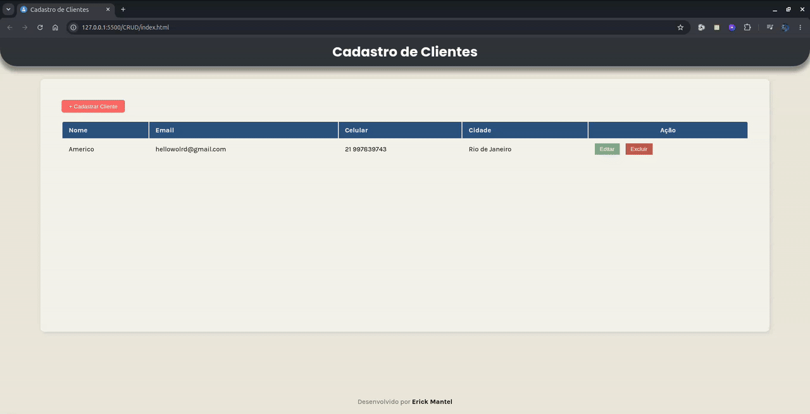

# 📋 Sistema de Cadastro de Clientes (CRUD)

> Aplicação web interativa para gerenciamento de clientes com persistência de dados local e validação de formlários.

---

## Link da Aplicação
🔗 [Clique aqui para testar o projeto]()

---

## Tecnologias Usadas
- **HTML5:** Estruturação semântica da aplicação e formulários.
- **CSS3:** Estilização responsiva, layout modular e overlays para janelas modais.
- **JavaScript (ES6+):** Manipulação da DOM, tratamento de eventos e regras de negócio do CRUD.
- **Local Storage:** Persistência dos dados no navegador do usuário.

---

## Funcionalidades
- [x] **Cadastrar:** Adiciona novos clientes com validação de campos.
- [x] **Listar:** Exibe os clientes cadastrados em tempo real em uma tabela interativa.
- [x] **Atualizar:** Edição de dados de clientes existentes através de modal interativa.
- [x] **Deletar:** Remoção de registros com confirmação.
- [x] **Persistência:** Mantém os dados gravados no `localStorage` mesmo após fechar o navegador.

